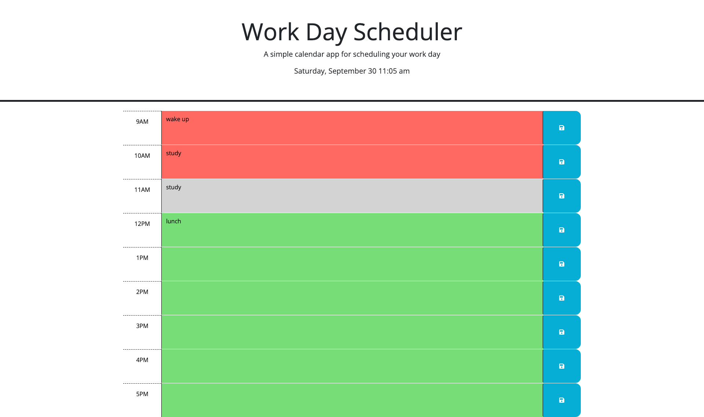

# work-day-scheduler

## Description

The Work Day Scheduler application is a calendar app that allows the user to input events into time-blocks spanning the 9am-5pm workday. The user can save the events and the data will persist in local storage. The hour time-blocks are color coded based on the current hour, provided by Day.js. The Work Day Scheduler uses JQuery to dynamically update the html and css of the webpage. 

## Usage

Access my Work Day Scheduler at [https://gfuselier.github.io/work-day-scheduler](https://gfuselier.github.io/work-day-scheduler)

## Credits
Tutor - Chris B

## License
N/A